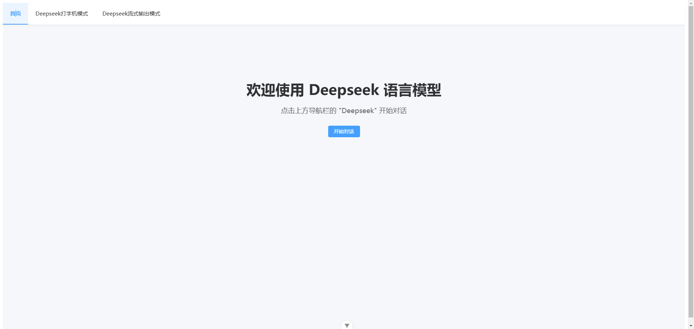
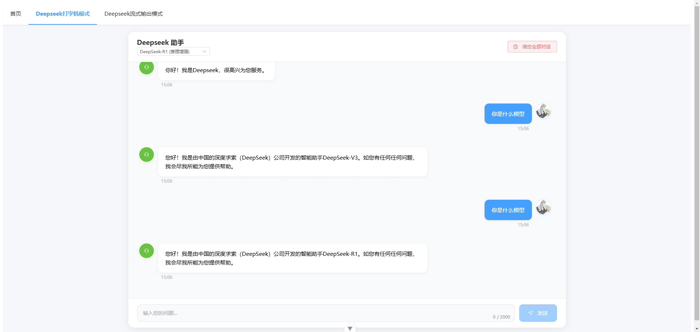
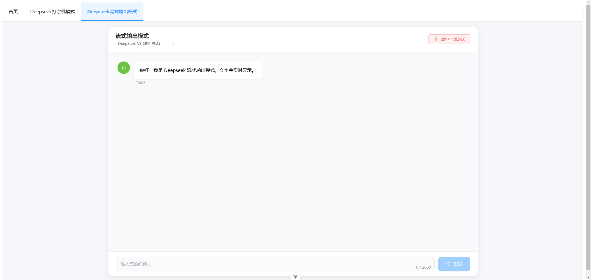

# DeepSeek AI 聊天助手集成指南

先看完整效果：
<video controls style="width: 100%;">
  <source src="./assets/deepseek/Deepseek.mp4" type="video/mp4">
  您的浏览器不支持 HTML5 视频标签。
</video>


效果图：

效果图：


## 目录

1. [项目概述](#项目概述)
2. [功能特点](#功能特点)
3. [环境准备](#环境准备)
4. [项目结构](#项目结构)
5. [组件详解](#组件详解)
   - [ChatContainer](#1-chatcontainervue)
   - [ChatInput](#2-chatinputvue)
   - [MessageBubble](#3-messagebbubblevue)
   - [TypeWriter](#4-typewritervue)
6. [核心代码示例](#核心代码示例)
7. [使用指南](#使用指南)
8. [常见问题](#常见问题)

## 项目概述

基于 Vue 3 + TypeScript + Element Plus 开发的 AI 聊天助手，集成了 DeepSeek 的 API 服务。提供打字机模式和流式输出两种对话模式，支持多种 AI 模型切换。

## 功能特点

| 基础功能 | 交互体验 | UI/UX | 其他特性 |
|---------|---------|-------|----------|
| 🚀 Vue 3 Composition API | ✨ 打字机效果 | 🎨 Element Plus UI | 📱 响应式设计 |
| 💪 TypeScript 支持 | 🌊 流式实时输出 | 🖼️ 自定义用户头像 | 🔄 模型切换 |
| 🔌 DeepSeek API 集成 | ⌚ 消息时间显示 | 🎭 思考状态动画 | 🗑️ 对话清空 |

## 环境准备

### 1. 安装依赖
```bash
# 创建项目
npm create vue@latest

# 安装依赖
npm install element-plus @element-plus/icons-vue axios
```

### 2. 环境配置
创建 `.env.local` 文件：
```env
VITE_DEEPSEEK_API_KEY=your_api_key_here
```

## 项目结构

```
src/
├── components/chat/          # 聊天相关组件
│   ├── ChatContainer.vue    # 聊天容器组件
│   ├── ChatInput.vue        # 输入组件
│   ├── MessageBubble.vue    # 消息气泡组件
│   └── TypeWriter.vue       # 打字机效果组件
├── services/
│   └── aiService.ts         # API 服务封装
├── views/
│   ├── ChatView.vue        # 打字机模式页面
│   └── StreamView.vue      # 流式输出页面
└── App.vue                 # 根组件
```

## 组件详解

### 1. ChatContainer.vue

聊天界面的核心容器组件。

#### 功能特性
- 📝 消息列表管理
- 🔄 自动滚动控制
- ⌨️ 打字机效果管理
- 🔀 模型切换
- 🗑️ 清空对话
- 💫 思考状态动画
- 📱 响应式适配

#### 组件 API

```typescript
// Props
interface Props {
  title?: string                 // 聊天标题
  messages: Message[]            // 消息列表
  loading?: boolean              // 加载状态
  streamMode?: boolean          // 流式模式
}

// Events
interface Events {
  send: (message: string) => void
  clear: () => void
  modelChange: (model: ModelType) => void
}
```

完整代码如下：
```html
<template>
  <!-- 聊天容器主组件 -->
  <div class="chat-container">
    <!-- 聊天头部：标题和清空按钮 -->
    <div class="chat-header">
      <div class="header-left">
        <h3>{{ title }}</h3>
        <el-select 
          v-model="currentModel" 
          size="small" 
          class="model-select"
          :disabled="loading"
        >
          <el-option
            v-for="(label, model) in modelOptions"
            :key="model"
            :label="label"
            :value="model"
          />
        </el-select>
      </div>
      <el-button 
        type="danger" 
        plain
        class="clear-button"
        @click="showClearConfirm"
      >
        <template #icon>
          <el-icon><Delete /></el-icon>
        </template>
        清空全部对话
      </el-button>
    </div>

    <!-- 消息列表区域：包含所有对话内容 -->
    <div class="chat-messages" ref="messagesContainer">
      <!-- 循环渲染消息气泡 -->
      <MessageBubble
        v-for="(message, index) in messages"
        :key="index"
        :content="message.content"
        :is-user="message.role === 'user'"
        :use-typewriter="!initialLoad && !streamMode && message.role === 'assistant'"
        @complete="handleMessageComplete(index)"
      />
      <!-- AI思考中状态显示 -->
      <div v-if="loading && (!messages.length || messages[messages.length - 1].role === 'user')" 
           class="message message-ai thinking-message">
        <div class="message-content">
          <div class="avatar-wrapper">
            <el-avatar :size="40" class="ai-avatar">
              <el-icon><Service /></el-icon>
            </el-avatar>
          </div>
          <div class="bubble-wrapper">
            <div class="bubble thinking-bubble">
              <div class="dots-container">
                <span class="dot"></span>
                <span class="dot"></span>
                <span class="dot"></span>
              </div>
            </div>
          </div>
        </div>
      </div>
    </div>

    <!-- 输入区域组件 -->
    <ChatInput 
      :disabled="loading || isTyping"
      @send="$emit('send', $event)"
    />

    <!-- 确认弹窗 -->
    <el-dialog
      v-model="showConfirmDialog"
      title="确认清空"
      width="400px"
      :show-close="false"
      class="clear-dialog"
    >
      <div class="dialog-content">
        <el-icon class="warning-icon" color="#E6A23C"><Warning /></el-icon>
        <p>确定要清空所有对话记录吗？</p>
        <p class="warning-text">此操作不可恢复</p>
      </div>
      <template #footer>
        <div class="dialog-footer">
          <el-button @click="showConfirmDialog = false">取消</el-button>
          <el-button type="danger" @click="handleClear">
            确认清空
          </el-button>
        </div>
      </template>
    </el-dialog>
  </div>
</template>

<script setup lang="ts">
import { ref, onMounted, nextTick, watch } from 'vue'
import { Service, Loading, Delete, Warning } from '@element-plus/icons-vue'
import { ModelType } from '@/services/aiService'

// 消息类型定义
interface Message {
  role: 'user' | 'assistant' | 'system'
  content: string
}

// 组件属性定义
const props = defineProps<{
  title?: string          // 聊天标题
  messages: Message[]     // 消息列表
  loading?: boolean       // 加载状态
  streamMode?: boolean     // 新增流式模式属性
}>()

// 定义组件事件
const emit = defineEmits<{
  send: [message: string]
  clear: []
  modelChange: [model: ModelType]
}>()

// 组件状态
const messagesContainer = ref<HTMLElement | null>(null)
const isTyping = ref(false)
const initialLoad = ref(true) // 添加初始加载标记

// 确认弹窗状态
const showConfirmDialog = ref(false)

// 模型选项
const modelOptions = {
  [ModelType.Chat]: 'DeepSeek-V3 (通用对话)',
  [ModelType.Reasoner]: 'DeepSeek-R1 (推理增强)'
}

// 当前选择的模型
const currentModel = ref<ModelType>(ModelType.Chat)

// 处理消息打字完成事件
const handleMessageComplete = (index: number) => {
  if (index === props.messages.length - 1) {
    isTyping.value = false
  }
}

// 监听新消息，控制打字机效果
watch(() => props.messages, (newMessages, oldMessages) => {
  // 跳过初始加载的消息
  if (initialLoad.value) {
    initialLoad.value = false
    return
  }

  if (newMessages.length > oldMessages?.length) {
    const lastMessage = newMessages[newMessages.length - 1]
    // 只在非流式模式下启用打字机效果
    if (lastMessage.role === 'assistant' && !props.streamMode) {
      isTyping.value = true
    }
  }
}, { deep: true })

// 监听模型变化
watch(currentModel, (newModel) => {
  emit('modelChange', newModel)
})

// 滚动到底部方法
const scrollToBottom = async () => {
  await nextTick()
  if (messagesContainer.value) {
    messagesContainer.value.scrollTop = messagesContainer.value.scrollHeight
  }
}

// 监听消息变化，自动滚动
watch(() => props.messages, scrollToBottom, { deep: true })

// 组件挂载时滚动到底部
onMounted(() => {
  scrollToBottom()
  // 初始加载完成后重置标记
  nextTick(() => {
    initialLoad.value = false
  })
})

// 显示确认弹窗
const showClearConfirm = () => {
  showConfirmDialog.value = true
}

// 处理清空操作
const handleClear = () => {
  showConfirmDialog.value = false
  emit('clear')
}
</script>

<style scoped>
/* 容器基础样式 */
.chat-container {
  display: flex;
  flex-direction: column;
  height: 100%;
  width: 100%;
  max-width: 1200px;
  margin: 0 auto;
  background: #fff;
  border-radius: 16px;
  box-shadow: 0 4px 20px rgba(0, 0, 0, 0.08);
  overflow: hidden;
}

/* 头部样式优化 */
.chat-header {
  display: flex;
  justify-content: space-between;
  align-items: center;
  box-sizing: border-box;
  padding: 16px 24px;  /* 减小内边距 */
  background: #fff;
  border-bottom: 1px solid #eee;
  box-shadow: 0 1px 6px rgba(0, 0, 0, 0.02);  /* 减小阴影 */
  z-index: 1;
}

.chat-header h3 {
  font-size: 18px;  /* 减小标题字号 */
  font-weight: 600;
  color: #303133;
  margin: 0;
}

/* 在线状态指示器调整 */
.chat-header h3::before {
  width: 6px;  /* 减小指示点大小 */
  height: 6px;
  margin-right: 8px;
}

/* 消息列表区域样式 */
.chat-messages {
  flex: 1;
  overflow-y: auto;
  padding: 30px;
  display: flex;
  flex-direction: column;
  gap: 24px;
  background: #f9fafb;
  background-image: 
    radial-gradient(circle at 25px 25px, rgba(0, 0, 0, 0.02) 2%, transparent 0%),
    radial-gradient(circle at 75px 75px, rgba(0, 0, 0, 0.02) 2%, transparent 0%);
  background-size: 100px 100px;
  scroll-behavior: smooth;
  scrollbar-width: thin;
  scrollbar-color: transparent transparent;
}

/* 加载动画 */
.loading {
  animation: rotating 2s linear infinite;
  margin-right: 8px;
}

@keyframes rotating {
  from { transform: rotate(0deg); }
  to { transform: rotate(360deg); }
}

/* 自定义滚动条样式 */
.chat-messages::-webkit-scrollbar {
  width: 4px;
}

.chat-messages::-webkit-scrollbar-track {
  background: transparent;
}

.chat-messages::-webkit-scrollbar-thumb {
  background-color: rgba(0, 0, 0, 0.1);
  border-radius: 4px;
  transition: all 0.3s ease;
}

/* 只在悬停时显示滚动条 */
.chat-messages:hover::-webkit-scrollbar-thumb {
  background-color: rgba(0, 0, 0, 0.2);
}

/* 响应式布局 */
@media (max-width: 1400px) {
  .chat-container {
    max-width: 1000px;
  }
}

@media (max-width: 1200px) {
  .chat-container {
    height: 100%;
    margin: 0;
    border-radius: 0;
  }
  
  .chat-view {
    padding: 0;
  }
}

/* 思考中状态样式 */
.thinking-message {
  opacity: 0.8;
  animation: fadeInUp 0.3s ease-out;
}

/* 思考中的气泡样式 */
.thinking-bubble {
  min-width: 60px;
  padding: 12px 16px !important;
  background: rgba(255, 255, 255, 0.9) !important;
  backdrop-filter: blur(8px);
}

/* 跳动点动画 */
.dots-container {
  display: flex;
  align-items: center;
  gap: 6px;
  height: 20px;
  padding: 0 4px;
}

.dot {
  width: 8px;
  height: 8px;
  background: #67c23a;
  border-radius: 50%;
  display: inline-block;
  opacity: 0.8;
  animation: bounce 1.4s infinite ease-in-out both;
}

.dot:nth-child(1) {
  animation-delay: -0.32s;
}

.dot:nth-child(2) {
  animation-delay: -0.16s;
}

@keyframes bounce {
  0%, 80%, 100% { 
    transform: scale(0);
  } 
  40% { 
    transform: scale(1);
  }
}

@keyframes fadeInUp {
  from {
    opacity: 0;
    transform: translateY(10px);
  }
  to {
    opacity: 0.8;
    transform: translateY(0);
  }
}

/* 消息位置调整 */
.message-ai.thinking-message {
  margin: 0;
  padding-top: 12px;
}

.message-ai.thinking-message .message-content {
  align-items: center;
}

.ai-avatar {
  background: #67c23a;
  box-shadow: 0 2px 8px rgba(103, 194, 58, 0.2);
}

.avatar-wrapper {
  width: 40px;
  height: 40px;
  flex-shrink: 0;
}

.bubble-wrapper {
  display: flex;
  flex-direction: column;
  gap: 4px;
}

.message {
  transition: transform 0.3s ease-out;
}

.thinking-message {
  position: sticky;
  bottom: 30px;
  margin-top: 20px;
  z-index: 1;
}

/* 清空按钮样式调整 */
.clear-button {
  padding: 8px 16px;  /* 减小按钮内边距 */
  font-size: 13px;    /* 减小字号 */
  height: 32px;       /* 固定高度 */
}

.clear-button :deep(.el-icon) {
  font-size: 14px;    /* 减小图标大小 */
  margin-right: 4px;
  vertical-align: -1px;
}

/* 头部布局间距调整 */
.header-left {
  gap: 12px;  /* 减小间距 */
}

/* 优化动画效果 */
@keyframes pulse {
  0% {
    transform: scale(0.95);
    box-shadow: 0 0 0 0 rgba(103, 194, 58, 0.3);
  }
  70% {
    transform: scale(1);
    box-shadow: 0 0 0 4px rgba(103, 194, 58, 0);
  }
  100% {
    transform: scale(0.95);
    box-shadow: 0 0 0 0 rgba(103, 194, 58, 0);
  }
}

/* 弹窗样式 */
.clear-dialog :deep(.el-dialog__header) {
  padding: 20px 24px;
  margin: 0;
  border-bottom: 1px solid #eee;
}

.clear-dialog :deep(.el-dialog__title) {
  font-size: 18px;
  font-weight: 600;
}

.clear-dialog :deep(.el-dialog__body) {
  padding: 30px 24px;
}

.clear-dialog :deep(.el-dialog__footer) {
  padding: 16px 24px;
  border-top: 1px solid #eee;
}

.dialog-content {
  display: flex;
  flex-direction: column;
  align-items: center;
  text-align: center;
}

.warning-icon {
  font-size: 48px;
  margin-bottom: 16px;
}

.dialog-content p {
  margin: 0;
  font-size: 16px;
  color: #303133;
}

.warning-text {
  margin-top: 8px !important;
  font-size: 14px !important;
  color: #909399 !important;
}

.dialog-footer {
  display: flex;
  justify-content: flex-end;
  gap: 12px;
}

/* 弹窗动画 */
.clear-dialog :deep(.el-overlay) {
  backdrop-filter: blur(4px);
}

.clear-dialog :deep(.el-dialog) {
  border-radius: 12px;
  overflow: hidden;
  box-shadow: 0 8px 24px rgba(0, 0, 0, 0.1);
}

/* 按钮样式优化 */
.dialog-footer :deep(.el-button) {
  padding: 10px 20px;
  border-radius: 6px;
  font-weight: 500;
}

.dialog-footer :deep(.el-button--danger) {
  box-shadow: 0 2px 8px rgba(245, 108, 108, 0.2);
}

.dialog-footer :deep(.el-button--danger:hover) {
  transform: translateY(-1px);
  box-shadow: 0 4px 12px rgba(245, 108, 108, 0.3);
}

/* 模型选择器样式优化 */
.model-select {
  width: 200px;
}

:deep(.el-select .el-input__wrapper) {
  padding: 0 12px;  /* 减小内边距 */
  height: 32px;     /* 减小高度 */
}

:deep(.el-select .el-input__inner) {
  font-size: 13px;  /* 减小字号 */
}
</style> 
```


### 2. ChatInput.vue

输入组件特点：

- 自适应文本框高度
- 字数限制和显示
- Enter 快捷发送
- 优雅的加载状态
- 内联发送按钮
- 防重复提交

#### `template` 部分

- **`.chat-input`**: 组件容器
- **`.input-wrapper`**: 输入框和按钮的包装容器
- **`el-input`**: 文本输入框，支持 `textarea` 自动伸缩
- **`el-button`**: 发送按钮，带 `Position` 图标

#### `script setup` 部分

#### 组件属性 `props`

- `disabled`：是否禁用输入框（可选）

#### 组件事件 `emit`

- `send(message: string)`：发送消息事件

#### 组件状态 `ref`

- `message`：输入的消息内容

#### 关键方法

- `handleSend()`：发送消息，去除前后空格，防止空消息发送

#### 组件使用
```html
<ChatInput :disabled="isLoading" @send="handleSendMessage" />
```
完整代码如下：
```html
<template>
  <!-- 聊天输入组件 -->
  <div class="chat-input">
    <div class="input-wrapper">
      <el-input
        v-model="message"
        type="textarea"
        :maxlength="2000"
        :autosize="{ minRows: 1, maxRows: 4 }"
        show-word-limit
        resize="none"
        placeholder="输入您的问题..."
        @keyup.enter.exact="handleSend"
        :disabled="disabled"
        class="custom-input"
      />
      <el-button 
        type="primary" 
        :loading="disabled"
        @click="handleSend"
        :disabled="!message.trim()"
        class="send-button"
      >
        <template #icon>
          <el-icon><Position /></el-icon>
        </template>
        发送
      </el-button>
    </div>
  </div>
</template>

<script setup lang="ts">
import { ref } from 'vue'
import { Position } from '@element-plus/icons-vue'

// 组件属性定义
const props = defineProps<{
  disabled?: boolean    // 禁用状态
}>()

// 定义事件
const emit = defineEmits<{
  send: [message: string]  // 发送消息事件
}>()

// 输入内容
const message = ref('')

// 发送消息处理
const handleSend = () => {
  const trimmedMessage = message.value.trim()
  if (!trimmedMessage || props.disabled) return
  
  emit('send', trimmedMessage)
  message.value = ''
}
</script>

<style scoped>
/* 输入区域容器样式 */
.chat-input {
  padding: 16px 24px;
  border-top: 1px solid #eee;
  background: #fff;
  border-radius: 0 0 16px 16px;
  position: relative;
}

/* 输入框包装器 */
.input-wrapper {
  position: relative;
  display: flex;
  gap: 12px;
  align-items: flex-start;
}

/* 输入框样式优化 */
.custom-input {
  flex: 1;
  transition: all 0.3s ease;
}

.custom-input :deep(.el-textarea__inner) {
  padding: 12px 16px;
  padding-right: 120px; /* 为字数限制留出空间 */
  font-size: 14px;
  border-radius: 12px;
  border: 1px solid #e4e7ed;
  background: #f9fafb;
  box-shadow: inset 0 1px 2px rgba(0, 0, 0, 0.02);
  transition: all 0.3s ease;
  line-height: 1.6;
  min-height: 48px;
  resize: none;
}

.custom-input :deep(.el-textarea__inner:hover) {
  background: #fff;
  border-color: #c0c4cc;
}

.custom-input :deep(.el-textarea__inner:focus) {
  background: #fff;
  border-color: #409eff;
  box-shadow: 0 0 0 2px rgba(64, 158, 255, 0.1);
}

/* 字数限制样式 */
.custom-input :deep(.el-input__count) {
  position: absolute;
  right: 12px;
  bottom: 8px;
  background: transparent;
  font-size: 12px;
  color: #909399;
  padding: 0;
  height: auto;
  line-height: 1;
  margin: 0;
}

/* 发送按钮样式 */
.send-button {
  padding: 0 24px;
  font-size: 14px;
  border-radius: 10px;
  height: 48px;
  transition: all 0.3s cubic-bezier(0.4, 0, 0.2, 1);
  font-weight: 500;
  white-space: nowrap;
  flex-shrink: 0;
}

.send-button:not(:disabled) {
  background: linear-gradient(135deg, #409eff, #3a8ee6);
  border: none;
}

.send-button:not(:disabled):hover {
  transform: translateY(-1px);
  box-shadow: 0 4px 12px rgba(64, 158, 255, 0.3);
}

.send-button:not(:disabled):active {
  transform: translateY(0);
}

.send-button :deep(.el-icon) {
  font-size: 16px;
  margin-right: 4px;
  vertical-align: -2px;
}

/* 禁用状态样式 */
.custom-input :deep(.el-textarea__inner:disabled) {
  background: #f5f7fa;
  border-color: #e4e7ed;
  cursor: not-allowed;
  opacity: 0.7;
}

/* 响应式调整 */
@media (max-width: 768px) {
  .chat-input {
    padding: 12px 16px;
  }

  .input-wrapper {
    gap: 8px;
  }
  
  .send-button {
    padding: 0 16px;
    height: 48px;
  }

  .custom-input :deep(.el-textarea__inner) {
    padding-right: 90px;
  }
}

/* 超小屏幕隐藏发送按钮文字 */
@media (max-width: 480px) {
  .send-button {
    padding: 0;
    width: 48px;
  }

  .send-button :deep(.el-icon) {
    margin: 0;
  }

  .send-button span:not(.el-icon) {
    display: none;
  }
}
</style> 
```
### 3. MessageBubble.vue

消息气泡组件特点：

- 显示消息气泡
- 区分用户消息和 AI 消息
- 支持头像展示
- 支持打字机效果
- 自动格式化时间
  
#### `template` 部分

- **`.message`**: 主要消息容器，包含用户或 AI 消息

- **`.avatar-wrapper`**: 头像区域

- `.bubble-wrapper`

  : 消息内容区域

  - **`.bubble`**: 消息文本，支持打字机效果
  - **`.time`**: 消息时间

#### `script setup` 部分

##### 组件属性 `props`

- `content`：消息内容
- `isUser`：是否为用户消息
- `useTypewriter`（可选）：是否启用打字机效果

##### 组件事件 `emit`

- `complete`：打字机动画完成事件

##### 关键方法

- `formatTime()`：格式化消息时间（`HH:mm` 格式）

##### 组件使用
```html
<MessageBubble 
  :content="'你好！这是 AI 回复的消息。'" 
  :isUser="false" 
  :useTypewriter="true" 
  @complete="handleTypingComplete"
/>

```
完整代码如下：
```html
<template>
  <!-- 消息气泡组件 -->
  <div :class="['message', isUser ? 'message-user' : 'message-ai']">
    <div class="message-content">
      <!-- 头像区域 -->
      <div class="avatar-wrapper">
        <el-avatar 
          :size="40" 
          :class="isUser ? 'user-avatar' : 'ai-avatar'"
          :src="isUser ? userAvatar : undefined"
        >
          <el-icon v-if="isUser && !userAvatar"><User /></el-icon>
          <el-icon v-if="!isUser"><Service /></el-icon>
        </el-avatar>
      </div>
      <!-- 消息内容区域 -->
      <div class="bubble-wrapper">
        <div class="bubble">
          <TypeWriter
            v-if="!isUser && useTypewriter"
            :text="content"
            :speed="30"
            @complete="$emit('complete')"
          />
          <span v-else>{{ content }}</span>
        </div>
        <!-- 消息时间 -->
        <div class="time">{{ formatTime() }}</div>
      </div>
    </div>
  </div>
</template>

<script setup lang="ts">
import { User, Service } from '@element-plus/icons-vue'
import userAvatar from '@/assets/user.jpg'

// 组件属性定义
defineProps<{
  content: string      // 消息内容
  isUser: boolean      // 是否为用户消息
  useTypewriter?: boolean  // 是否使用打字机效果
}>()

// 定义事件
defineEmits<{
  complete: []      // 打字完成事件
}>()

// 格式化时间方法
const formatTime = () => {
  const now = new Date()
  return `${now.getHours().toString().padStart(2, '0')}:${now.getMinutes().toString().padStart(2, '0')}`
}
</script>

<style scoped>
/* 消息容器基础样式 */
.message {
  display: flex;
  margin-bottom: 20px;
  animation: fadeIn 0.3s ease-in-out;
}

/* 头像样式 */
.message-content {
  display: flex;
  align-items: flex-start;
  gap: 12px;
  max-width: 70%;
}

/* 用户头像样式 */
.avatar-wrapper {
  width: 40px;
  height: 40px;
  flex-shrink: 0;
}

.user-avatar {
  box-shadow: 0 2px 8px rgba(64, 158, 255, 0.2);
}

.user-avatar :deep(img) {
  object-fit: cover;
  width: 100%;
  height: 100%;
}

.ai-avatar {
  background: #67c23a;
  box-shadow: 0 2px 8px rgba(103, 194, 58, 0.2);
}

/* 气泡容器样式 */
.bubble-wrapper {
  display: flex;
  flex-direction: column;
  gap: 4px;
}

.message-user {
  justify-content: flex-end;
}

.message-user .message-content {
  flex-direction: row-reverse;
}

/* 消息气泡样式 */
.bubble {
  padding: 16px 20px;
  border-radius: 12px;
  background: #fff;
  line-height: 1.6;
  font-size: 15px;
  box-shadow: 0 2px 8px rgba(0, 0, 0, 0.05);
  position: relative;
  transition: all 0.3s ease;
}

.bubble:hover {
  box-shadow: 0 4px 12px rgba(0, 0, 0, 0.08);
}

.message-user .bubble {
  background: #409eff;
  color: white;
}

/* 时间显示样式 */
.time {
  font-size: 12px;
  color: #909399;
  margin: 0 8px;
  opacity: 0.8;
}

.message-user .time {
  text-align: right;
}

/* 动画效果 */
@keyframes fadeIn {
  from {
    opacity: 0;
    transform: translateY(10px);
  }
  to {
    opacity: 1;
    transform: translateY(0);
  }
}
</style> 
```

### 4. TypeWriter.vue
#### 组件描述
TypeWriter 组件用于实现文本逐字出现的打字机效果，适用于 AI 回复等场景。支持自定义打字速度、延迟时间，并提供事件监听打字过程。

#### 打字机效果组件特点：

- 逐字显示文本
- 自定义打字速度
- 支持延迟启动
- 文本变化时重新播放
- 提供文本更新和完成事件

### 组件结构

#### `template` 部分

- **`<slot>`**: 组件支持插槽，默认显示 `displayText`

#### `script setup` 部分

##### 组件属性 `props`

- `text`：要显示的文本
- `speed`（可选）：打字速度（默认 `30ms`）
- `delay`（可选）：延迟启动时间（默认 `0ms`）

##### 组件事件 `emit`

- `complete`：打字完成事件
- `textUpdate`：每次文本更新时触发

##### 组件状态

- `displayText`：当前已显示的文本
- `currentIndex`：当前打字位置
- `timer`：定时器引用

##### 关键方法

- `startTyping()`：递归执行逐字显示文本
- 监听 `props.text` 变化，重新播放打字动画
- `onUnmounted()` 清理定时器

##### 组件使用
```html
<TypeWriter 
  :text="'你好，这是打字机效果演示。'" 
  :speed="50" 
  :delay="500"
  @complete="handleComplete"
  @textUpdate="handleTextUpdate"
>
  <template #default="{ text }">
    <span class="custom-style">{{ text }}</span>
  </template>
</TypeWriter>

```

完整代码如下：
```html
<template>
  <!-- 打字机效果组件 -->
  <div>
    <slot :text="displayText">{{ displayText }}</slot>
  </div>
</template>

<script setup lang="ts">
import { ref, watch, onUnmounted } from 'vue'

// 组件属性定义
const props = defineProps<{
  text: string      // 要显示的文本
  speed?: number    // 打字速度
  delay?: number    // 开始延迟
}>()

// 定义事件
const emit = defineEmits<{
  complete: []                  // 打字完成事件
  textUpdate: [text: string]    // 文本更新事件
}>()

// 组件状态
const displayText = ref('')
let currentIndex = 0
let timer: number | null = null

// 打字效果实现
const startTyping = () => {
  if (currentIndex < props.text.length) {
    displayText.value = props.text.slice(0, currentIndex + 1)
    emit('textUpdate', displayText.value)
    currentIndex++
    timer = window.setTimeout(startTyping, props.speed || 30)
  } else {
    emit('complete')
  }
}

// 监听文本变化
watch(() => props.text, () => {
  if (timer) {
    clearTimeout(timer)
  }
  currentIndex = 0
  displayText.value = ''
  timer = window.setTimeout(startTyping, props.delay || 0)
}, { immediate: true })

// 组件卸载时清理定时器
onUnmounted(() => {
  if (timer) {
    clearTimeout(timer)
  }
})
</script>

<style scoped>
/* 打字机容器样式 */
.typewriter {
  display: inline-block;
}
</style> 
```
## API 集成

### aiService.ts

封装 DeepSeek API 的 AI 聊天服务，支持普通聊天、推理模式、流式响应等功能。提供灵活的模型切换和参数配置：

```typescript
class AIChatService {
  // 普通对话请求
  async chat(messages: ChatCompletionRequestMessage[]) {
    // ... API 调用实现
  }

  // 流式对话请求
  async streamChat(
    messages: ChatCompletionRequestMessage[],
    onChunk: (chunk: string) => void
  ) {
    // ... 流式 API 调用实现
  }

  // 模型配置更新
  updateConfig(newConfig: Partial<ChatRequestConfig>) {
    // ... 配置更新逻辑
  }
}
```

#### **功能特点**

1. **支持普通聊天（同步请求）**
2. **支持推理模型（Reasoner）**
3. **支持流式响应**
4. **支持动态更新 API 配置**
5. **提供错误处理**

#### **枚举 `ModelType`**

| 枚举项     | 说明                            |
| ---------- | ------------------------------- |
| `Chat`     | 普通聊天模型（`deepseek-chat`） |
| `Reasoner` | 推理模型（`deepseek-reasoner`） |

#### **类方法**

| 方法                                                         | 说明                     |
| ------------------------------------------------------------ | ------------------------ |
| `chat(messages: ChatCompletionRequestMessage[])`             | 发送聊天请求（同步）     |
| `reason(prompt: string)`                                     | 使用 `Reasoner` 模型推理 |
| `updateConfig(newConfig: Partial<ChatRequestConfig>)`        | 更新配置                 |
| `streamChat(messages: ChatCompletionRequestMessage[], onChunk: (chunk: string) => void)` | 流式聊天                 |
| `streamReason(prompt: string, onChunk: (chunk: string) => void)` | 流式推理                 |

#### **使用示例**

##### **普通聊天**

```js
const response = await aiService.chat([{ role: 'user', content: '你好，AI！' }])
console.log(response)  // 输出 AI 回复
```

##### **流式聊天**

```js
await aiService.streamChat(
  [{ role: 'user', content: '请介绍一下 Vue 3' }],
  (chunk) => {
    console.log('AI 回复片段:', chunk)
  }
)
```

##### **推理模式**

```js
const result = await aiService.reason('如何优化前端性能？')
console.log(result)
```

##### **更新配置**

```js
aiService.updateConfig({ temperature: 0.9, max_tokens: 1500 })
```


## 使用指南

### 打字机模式
```vue
<ChatContainer
  title="DeepSeek 打字机模式"
  :messages="messages"
  :loading="loading"
  @send="handleSend"
/>
```

### 流式输出模式
```vue
<ChatContainer
  title="DeepSeek 流式输出"
  :messages="messages"
  :loading="loading"
  :stream-mode="true"
  @send="handleStreamSend"
/>
```

## 常见问题

### API 相关
- ✅ 检查 API Key 配置
- 🌐 确认网络连接
- 🔍 查看控制台错误
- ⚙️ 验证请求参数

### 界面显示
- 📱 检查响应式布局
- 📏 确认容器高度
- 📜 验证滚动配置
- 🎨 检查样式冲突

### 性能优化
- 🔍 合理使用 v-show/v-if
- 🔄 避免深度监听
- 📊 优化滚动事件
- 💾 虚拟滚动处理

## 核心代码示例

### 1. 打字机效果 (TypeWriter.vue)
```vue
<template>
  <span ref="textContainer"></span>
</template>

<script setup lang="ts">
import { ref, onMounted, onUnmounted } from "vue";

const props = defineProps<{
  text: string;
  speed?: number;
}>();

const emit = defineEmits<{
  complete: [];
}>();

const textContainer = ref<HTMLElement | null>(null);
let currentIndex = 0;
let timer: number | null = null;

const startTyping = () => {
  if (currentIndex < props.text.length) {
    if (textContainer.value) {
      textContainer.value.textContent = props.text.slice(0, currentIndex + 1);
    }
    currentIndex++;
    timer = window.setTimeout(startTyping, props.speed || 30);
  } else {
    emit("complete");
  }
};

onMounted(() => {
  startTyping();
});

onUnmounted(() => {
  if (timer) clearTimeout(timer);
});
</script>
```

### 2. 流式输出 (StreamView.vue)
```vue
<script setup lang="ts">
const handleSend = async (message: string) => {
  messages.value.push({
    role: "user",
    content: message,
  });

  loading.value = true;

  try {
    const assistantMessage = {
      role: "assistant" as const,
      content: "",
    };
    messages.value.push(assistantMessage);

    // 流式回调处理
    const streamCallback = (chunk: string) => {
      assistantMessage.content += chunk;
    };

    await aiService.streamChat(messages.value.slice(0, -1), streamCallback);
  } catch (error) {
    ElMessage.error("发送消息失败，请重试");
    messages.value.pop();
  } finally {
    loading.value = false;
  }
};
</script>
```

### 3. API 服务 (aiService.ts)
```typescript
class AIChatService {
  // 配置定义
  private config: ChatRequestConfig = {
    model: "deepseek-chat",
    temperature: 0.7,
    max_tokens: 2000,
    stream: false,
    system_message: "你是一个友好的中文助手。",
  };

  // 普通对话请求
  async chat(messages: ChatCompletionRequestMessage[]) {
    try {
      const response = await axios.post(
        `${API_CONFIG.baseURL}/v1/chat/completions`,
        {
          model: this.config.model,
          messages: [
            { role: "system", content: this.config.system_message },
            ...messages,
          ],
          temperature: this.config.temperature,
          max_tokens: this.config.max_tokens,
        },
        {
          headers: {
            Authorization: `Bearer ${API_CONFIG.apiKey}`,
          },
        }
      );
      return response.data.choices[0].message.content;
    } catch (error) {
      throw new Error("聊天服务出错了");
    }
  }

  // 流式对话请求
  async streamChat(
    messages: ChatCompletionRequestMessage[],
    onChunk: (chunk: string) => void
  ) {
    try {
      const response = await fetch(
        `${API_CONFIG.baseURL}/v1/chat/completions`,
        {
          method: "POST",
          headers: {
            "Content-Type": "application/json",
            Authorization: `Bearer ${API_CONFIG.apiKey}`,
          },
          body: JSON.stringify({
            model: this.config.model,
            messages: [
              { role: "system", content: this.config.system_message },
              ...messages,
            ],
            stream: true,
          }),
        }
      );

      const reader = response.body?.getReader();
      const decoder = new TextDecoder();

      while (reader) {
        const { done, value } = await reader.read();
        if (done) break;

        const chunk = decoder.decode(value);
        const lines = chunk.split("\n").filter((line) => line.trim());

        for (const line of lines) {
          if (line.startsWith("data: ")) {
            const data = JSON.parse(line.slice(6));
            const content = data.choices[0].delta.content;
            if (content) onChunk(content);
          }
        }
      }
    } catch (error) {
      throw new Error("流式聊天服务出错了");
    }
  }
}
```

### 4. 思考动画 (ChatContainer.vue)
```vue
<template>
  <div v-if="loading" class="thinking-message">
    <div class="message-content">
      <el-avatar class="ai-avatar">
        <el-icon><Service /></el-icon>
      </el-avatar>
      <div class="bubble thinking-bubble">
        <div class="dots-container">
          <span class="dot"></span>
          <span class="dot"></span>
          <span class="dot"></span>
        </div>
      </div>
    </div>
  </div>
</template>

<style scoped>
.thinking-message {
  opacity: 0.8;
  animation: fadeInUp 0.3s ease-out;
}

.thinking-bubble {
  min-width: 60px;
  padding: 12px 16px;
  background: rgba(255, 255, 255, 0.9);
  backdrop-filter: blur(8px);
}

.dots-container {
  display: flex;
  align-items: center;
  gap: 6px;
  height: 20px;
}

.dot {
  width: 8px;
  height: 8px;
  background: #67c23a;
  border-radius: 50%;
  opacity: 0.8;
  animation: bounce 1.4s infinite ease-in-out both;
}

@keyframes bounce {
  0%,
  80%,
  100% {
    transform: scale(0);
  }
  40% {
    transform: scale(1);
  }
}

@keyframes fadeInUp {
  from {
    opacity: 0;
    transform: translateY(10px);
  }
  to {
    opacity: 0.8;
    transform: translateY(0);
  }
}
</style>
```
